# 2026-10 UI / 动效重做 · 效果图

由 `fushi/tool/design_preview/render_previews.sh`（Windows：`.ps1`）生成，用的是真实主题工厂与生产组件。
设计说明见 [`docs/specs/2026-10-02-ui-motion-redesign.md`](../../specs/2026-10-02-ui-motion-redesign.md)。

## 静态

| 桌面书架 · 浅色 | 桌面书架 · 深色 |
|---|---|
| 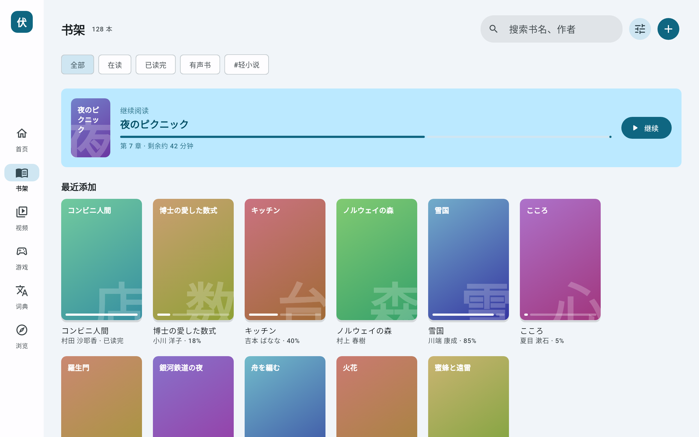 | 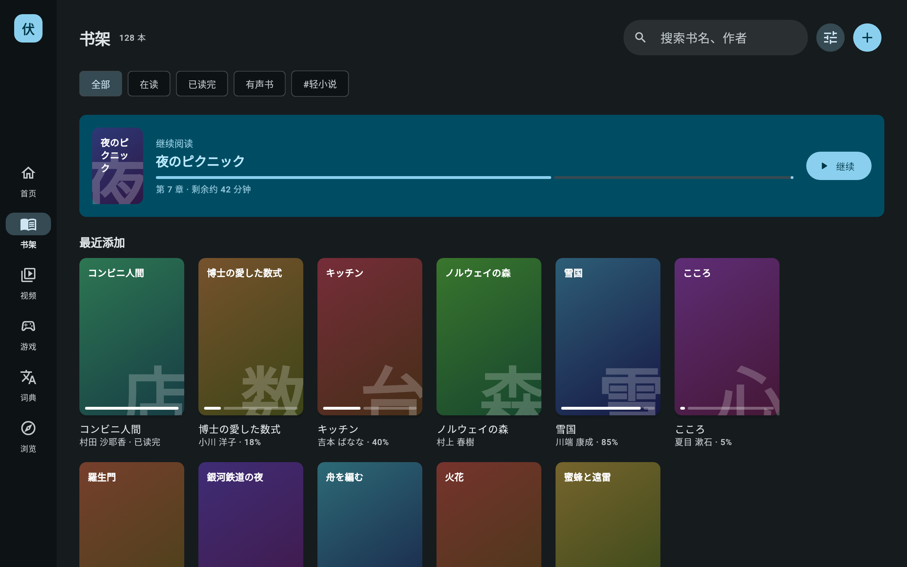 |

| 手机书架 · 浅色 | 手机书架 · 深色 | 组件 · 浅色 / 深色 |
|---|---|---|
| 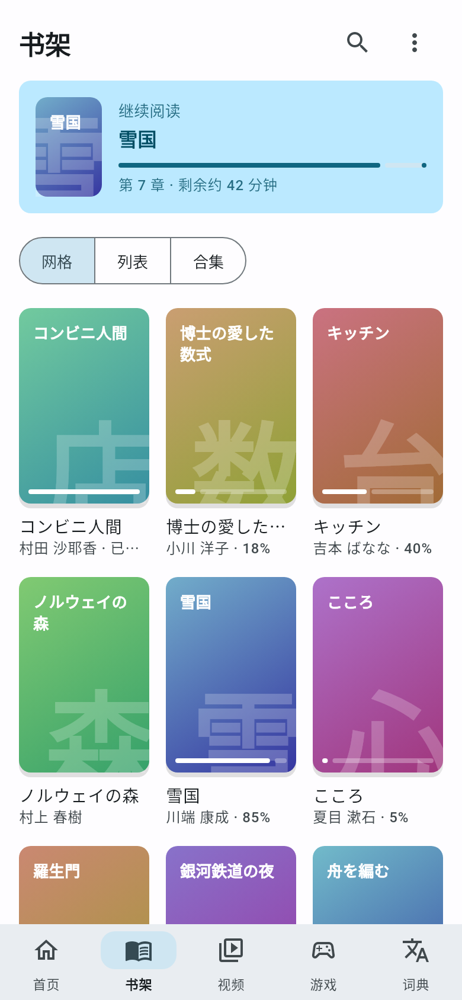 | 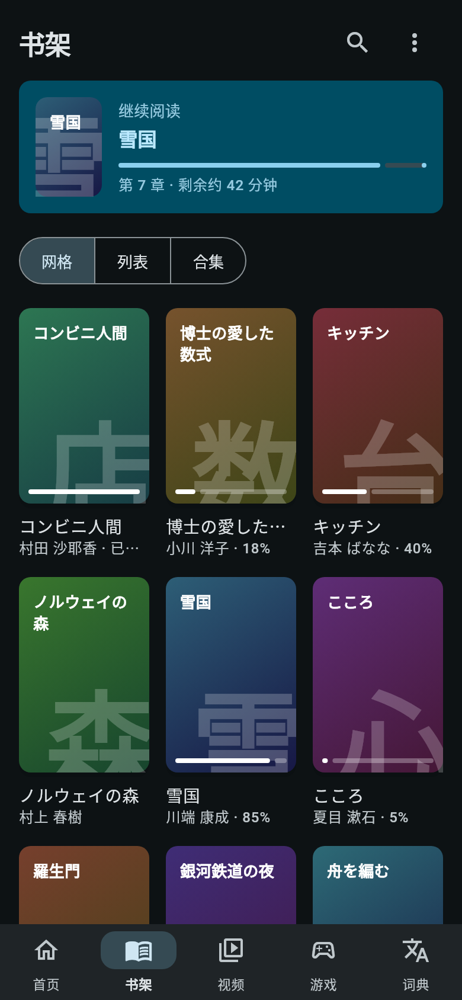 | 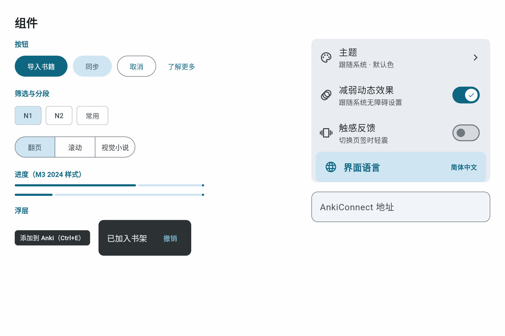 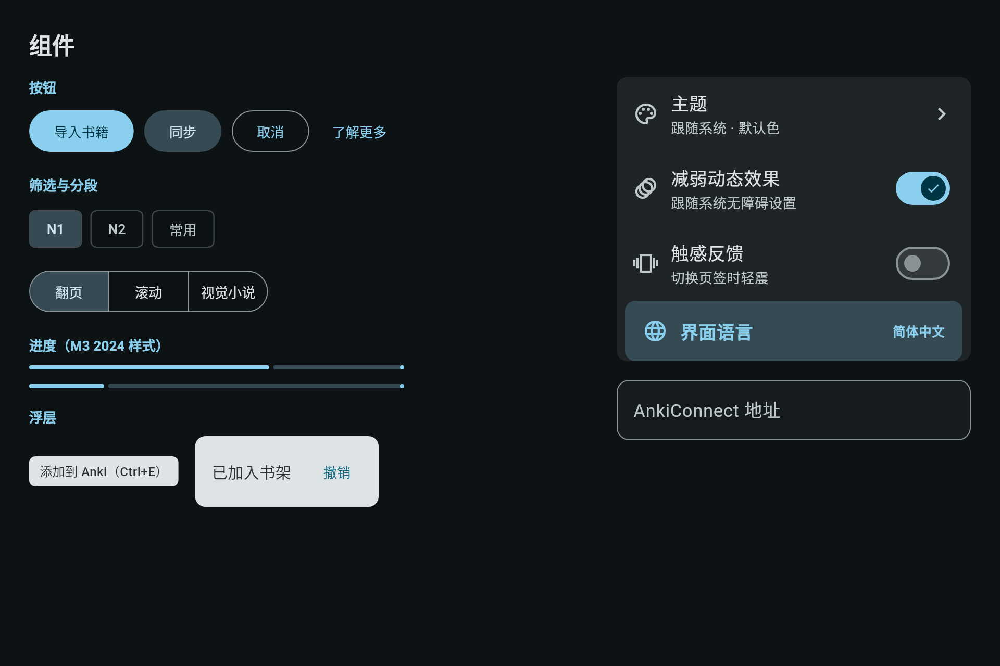 |

## 动效（胶片 = 逐帧采样；GIF = 6 fps 慢放）

- 底栏药丸展开：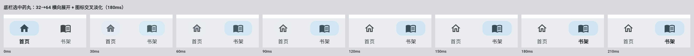 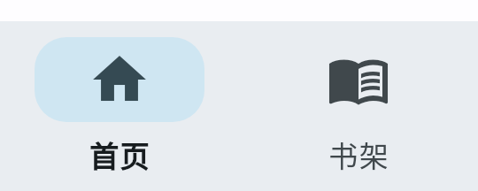
- 桌面页面转场（上：新共享轴；下：旧 Zoom）：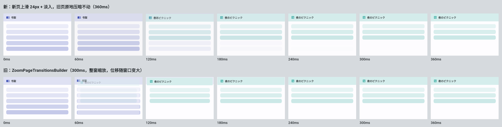
  新 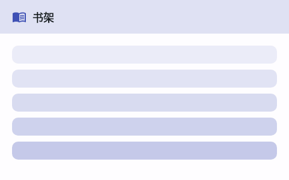 旧 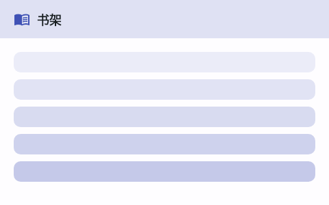
- 按压下沉与回弹：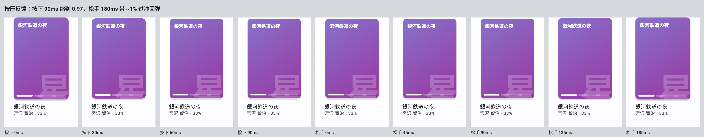 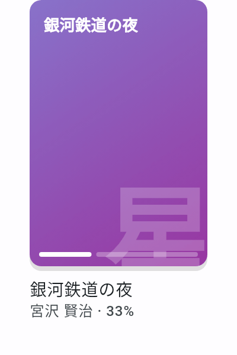
- 书架首屏错峰进场：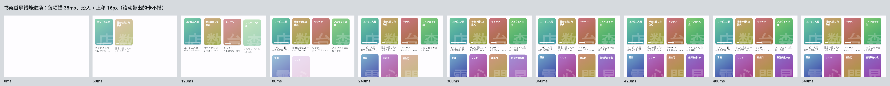 
- 曲线与时长：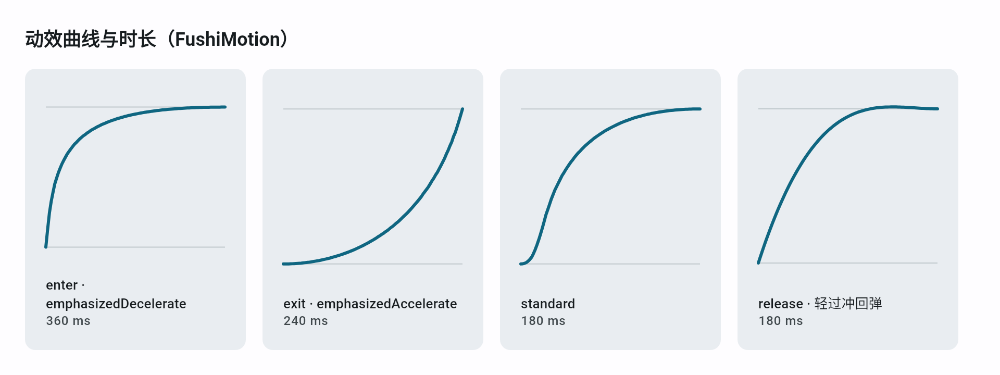
